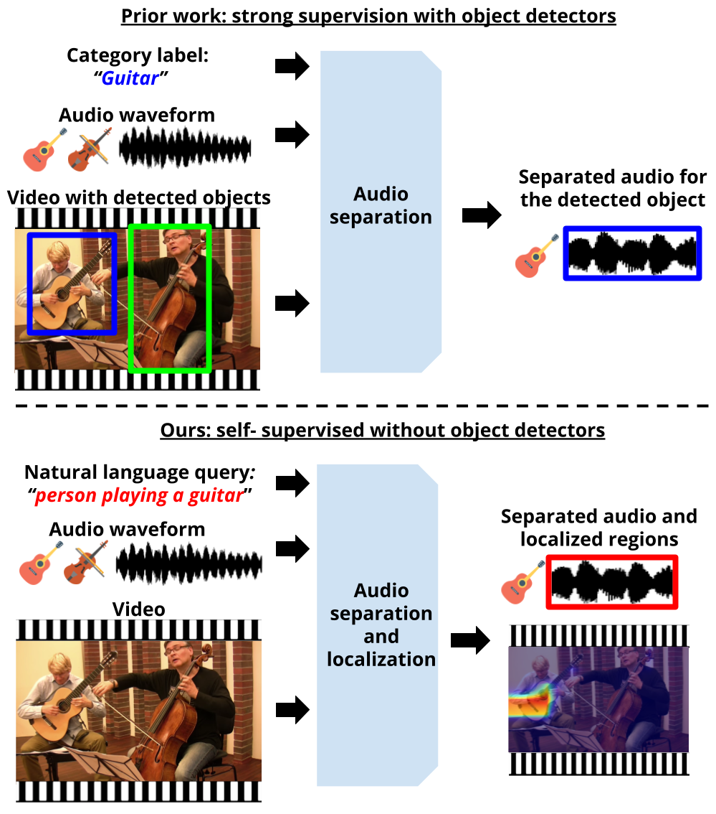

# Video-Audio Separation through Text (VAST)
Codebase for submission"Language-Guided Audio-Visual Source Separation via Trimodal Consistency".

*We are still setting up the code repository but the key code pieces are in there.



## Environment
The code is developed under the following configurations.
- Hardware: 1-4 GPUs (change ```[--num_gpus NUM_GPUS]``` accordingly)
- Software: Ubuntu 16.04.3 LTS, ***CUDA>=10.3, Python>=3.5, PyTorch>=1.9.0***

## Training
1. Prepare video dataset.

    a. Download MUSIC dataset from: https://github.com/roudimit/MUSIC_dataset
    
    b. Download videos.

2. Preprocess videos. You can do it in your own way as long as the index files are similar.

    a. Extract frames at 8fps and waveforms at 11025Hz from videos. We have following directory structure:
    ```
    data
    ├── audio
    |   ├── acoustic_guitar
    │   |   ├── M3dekVSwNjY.mp3
    │   |   ├── ...
    │   ├── trumpet
    │   |   ├── STKXyBGSGyE.mp3
    │   |   ├── ...
    │   ├── ...
    |
    └── frames
    |   ├── acoustic_guitar
    │   |   ├── M3dekVSwNjY.mp4
    │   |   |   ├── 000001.jpg
    │   |   |   ├── ...
    │   |   ├── ...
    │   ├── trumpet
    │   |   ├── STKXyBGSGyE.mp4
    │   |   |   ├── 000001.jpg
    │   |   |   ├── ...
    │   |   ├── ...
    │   ├── ...
    ```

    b. Make training/validation index files by running:
    ```
    python scripts/create_index_files.py
    ```
    It will create index files ```train.csv```/```val.csv``` with the following format:
    ```
    ./data/audio/acoustic_guitar/M3dekVSwNjY.mp3,./data/frames/acoustic_guitar/M3dekVSwNjY.mp4,1580
    ./data/audio/trumpet/STKXyBGSGyE.mp3,./data/frames/trumpet/STKXyBGSGyE.mp4,493
    ```
    For each row, it stores the information: ```AUDIO_PATH,FRAMES_PATH,NUMBER_FRAMES```

3. Train the default model.
```bash
./scripts/train_bimodal_cyclic_losses_solos_scc.sh
```

5. During training, visualizations are saved in HTML format under ```ckpt/MODEL_ID/visualization/```.

## Evaluation
0. (Optional) Download our trained model weights for evaluation.
```bash
./scripts/download_trained_model.sh
```

1. Evaluate the trained model performance.
```bash
./scripts/eval_MUSIC.sh
```

## Updates
We have observed that finetuning the separation model with the latent captions with a very low learning rate further helps to improve performance. More details will come soon. 
